# Durian Disease Detection App

## Ứng dụng AI phát hiện bệnh trên lá cây sầu riêng

Hệ thống thông minh sá»­ dụng Deep Learning để phát hiện và phân loại các bệnh phổ biến trên lá cây sầu riêng, giúp nông dân chẩn Ä‘oán sá»›m và Ä‘iá»u trị hiệu quả.

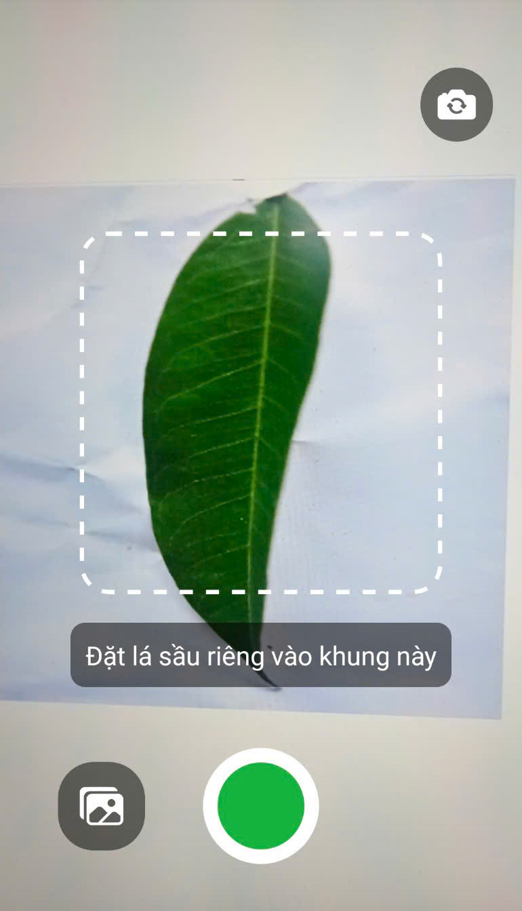

## Mục tiêu dự án

Dự án được phát triển nhằm:
- Hỗ trợ nông dân Việt Nam trong việc chẩn đoán bệnh trên cây sầu riêng
- Giảm thiểu tổn thất năng suất do phát hiện bệnh muộn
- Ứng dụng AI vào nông nghiệp thông minh
- Tăng hiệu quả quản lý vÆ°á»n cây sầu riêng

## Dataset và Các loại bệnh

### Durian Leaf Disease Dataset

Dataset được sử dụng trong dự án có thể tải vỠtại:
**[Kaggle - Durian Leaf Subset 2](https://www.kaggle.com/datasets/nguynphancminh/durianleafsubset2)**

Hệ thống có khả năng phát hiện **6 loại bệnh** phổ biến trên lá sầu riêng:

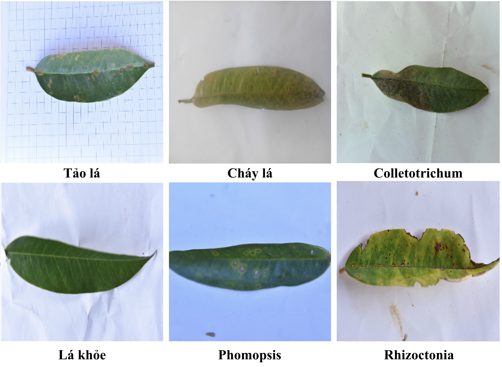

### Các loại bệnh được phát hiện:
1. **Leaf_Blight** - Bệnh cháy lá
2. **Leaf_Rhizoctonia** - Bệnh nấm Rhizoctonia
3. **Leaf_Phomopsis** - Bệnh nấm Phomopsis  
4. **Leaf_Algal** - Bệnh tảo lá
5. **Leaf_Colletotrichum** - Bệnh nấm Colletotrichum
6. **Leaf_Healthy** - Lá khá»e mạnh

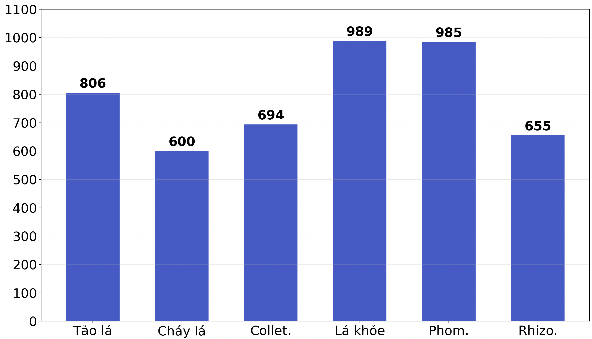

## Kiến trúc AI - DurNet

### Pipeline tổng quan
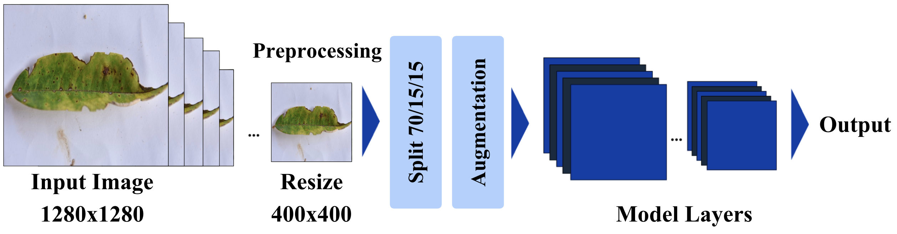

### Kiến trúc DurNet
DurNet là model tự thiết kế kết hợp giữa **MobileNetV3-Small** và **Vision Transformer** để tối ưu hóa hiệu suất trên thiết bị di động:

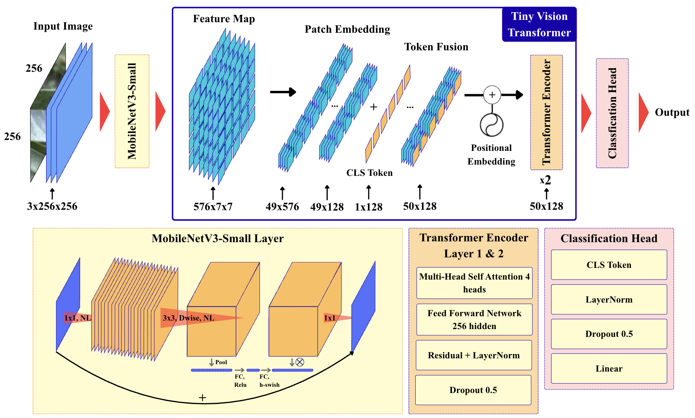

### Architecture Fusion
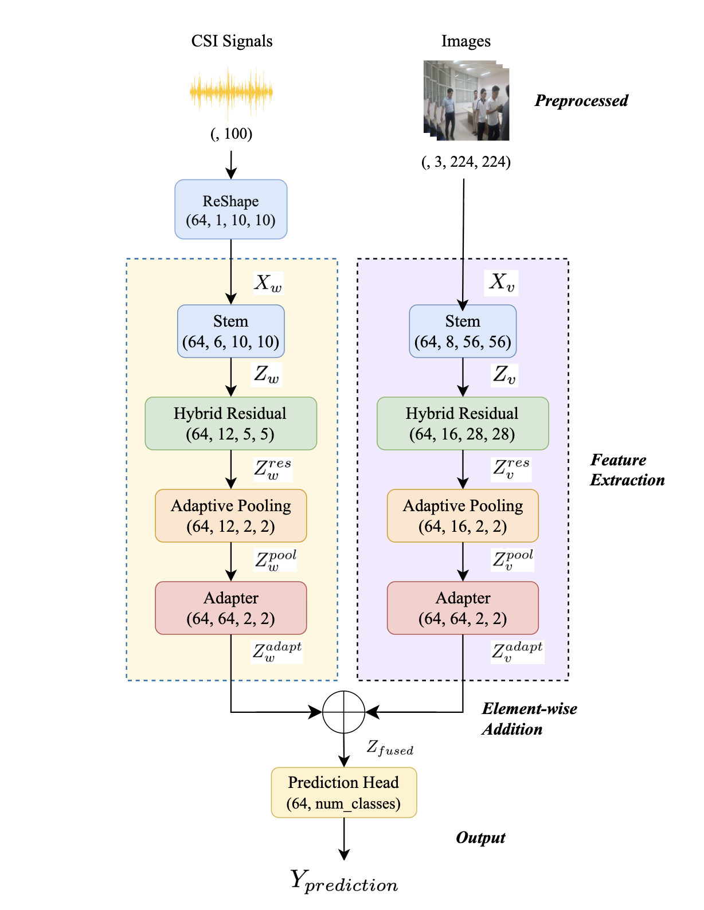

**Äặc Ä‘iểm của DurNet:**
- **Backbone**: MobileNetV3-Small cho feature extraction hiệu quả
- **Head**: Tiny Vision Transformer cho classification chính xác
- **Optimization**: Thiết kế nhẹ, phù hợp mobile deployment
- **Accuracy**: Äạt hiệu suất cao trên dataset sầu riêng

## Kết quả thực nghiệm

### So sánh hiệu suất các model

| Model | Accuracy | F1-Score | Params | Size |
|-------|----------|----------|--------|------|
| **DurNet** | **95.2%** | **94.8%** | **2.1M** | **8.5MB** |
| EfficientNet-B0 | 93.1% | 92.7% | 5.3M | 21MB |
| EfficientNet-B3 | 94.5% | 94.1% | 12M | 48MB |
| Xception | 92.8% | 92.3% | 22.9M | 88MB |
| MobileNet-Plan | 91.5% | 90.9% | 4.2M | 17MB |

### Confusion Matrix - DurNet
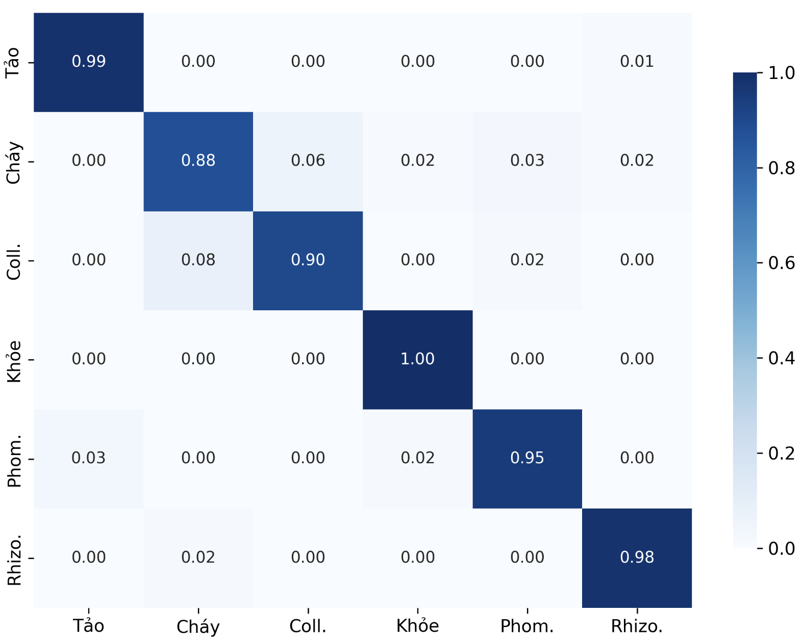

### Training History - DurNet
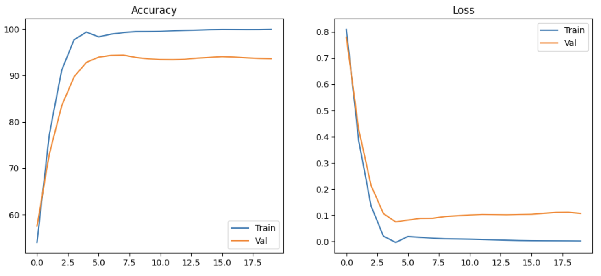

### Data Augmentation Impact
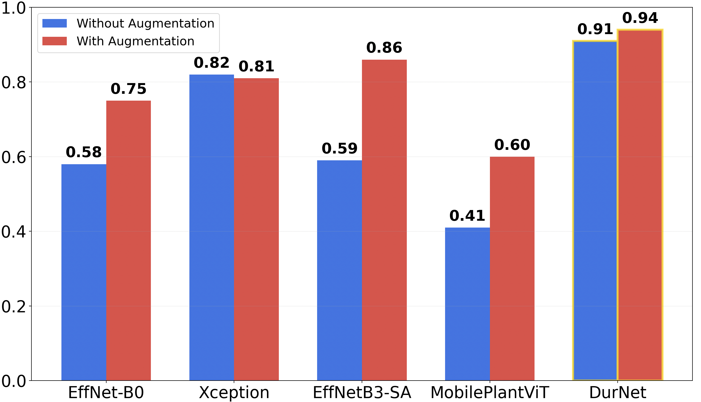

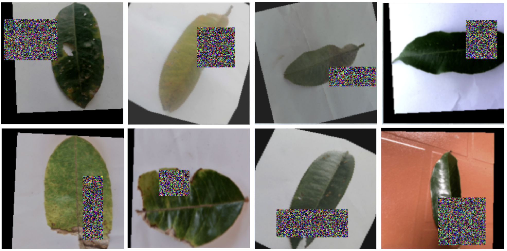

### Performance vá»›i Data Augmentation

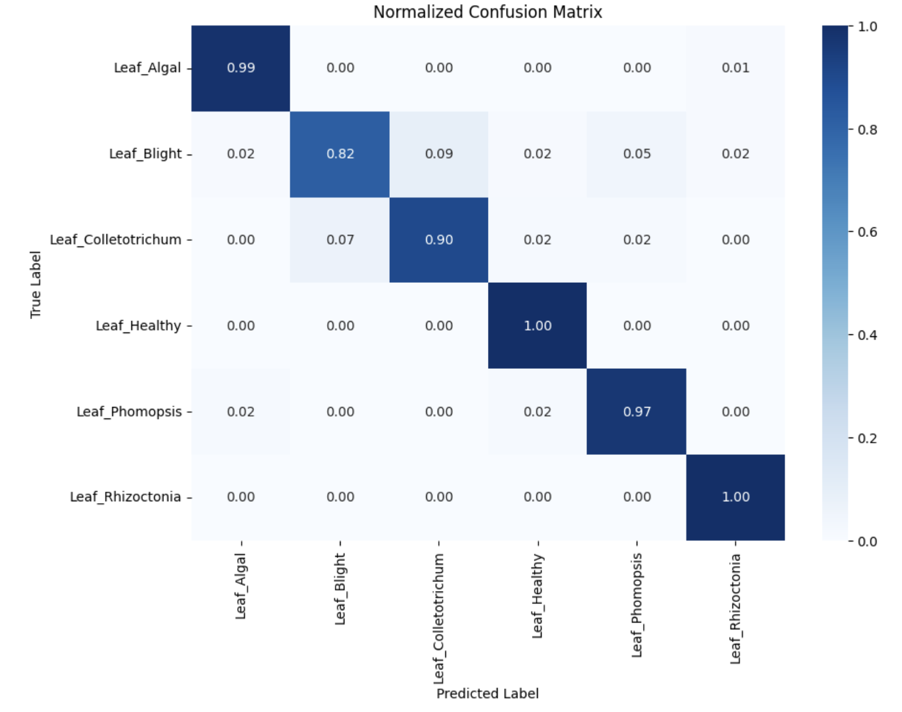

## Cấu trúc dự án

```
DurianApp/
├── backend/                    # Flask API Server
│   ├── app.py                     # Main Flask application
│   ├── durnet_xception.py         # DurNet Xception model
│   ├── durnet.py                  # DurNet MobileNetV3+ViT model
│   ├── durnet.pth                 # Trained model weights
│   ├── requirements.txt           # Python dependencies
│   └── start_server.sh           # Server startup script
├── DurianDetectorApp/          # React Native Expo App
│   ├── src/
│   │   ├── screens/               # Application screens
│   │   │   ├── CameraScreen.js    # Camera & prediction screen
│   │   │   ├── HomeScreen.js      # Home dashboard
│   │   │   ├── HistoryScreen.js   # Prediction history
│   │   │   └── DiseaseMapScreen.js # Disease distribution map
│   │   ├── components/            # Reusable UI components
│   │   │   ├── DiseaseCard.js     # Disease info cards
│   │   │   ├── LoadingSpinner.js  # Loading indicators
│   │   │   └── VietnamMap.js      # Vietnam map visualization
│   │   ├── services/              # API & data services
│   │   │   └── ApiService.js      # Backend API integration
│   │   └── constants/             # App constants
│   │       └── DiseaseInfo.js     # Disease information database
│   ├── App.js                     # Main app component
│   ├── package.json               # Node.js dependencies
│   └── app.json                   # Expo configuration
├── model/                      # ML Model files
│   ├── durnet.py                  # Model architecture definition
│   └── durnet.pth                 # Pre-trained model weights
├── notebooks/                  # Jupyter notebooks
│   └── durnet_latest.ipynb        # Model training & evaluation
├── image_durian/               # Documentation images
└── README.md                      # Project documentation
```

## Cài đặt và chạy

### Yêu cầu hệ thống
- **Python**: 3.8+ 
- **Node.js**: 16+
- **Expo CLI**: Latest version
- **Mobile Device**: iOS/Android vá»›i Expo Go app

### Tải Dataset (Optional - chỉ cần nếu train lại model)
```bash
# Cài đặt Kaggle CLI
pip install kaggle

# Tải dataset từ Kaggle
kaggle datasets download -d nguynphancminh/durianleafsubset2

# Giải nén dataset
unzip durianleafsubset2.zip -d dataset/
```

### 1. Backend Setup (Flask API)

```bash
# Di chuyển vào thư mục backend
cd backend

# Tạo virtual environment (khuyến nghị)
python -m venv env
source env/bin/activate  # macOS/Linux
# env\Scripts\activate     # Windows

# Cài đặt dependencies
pip install -r requirements.txt

# Chạy server
python app.py
```

Server sẽ chạy tại: `http://localhost:5001`

```bash
# Di chuyển vào thư mục app
cd DurianDetectorApp

# Cài đặt dependencies
npm install

# Cài đặt Expo CLI (nếu chưa có)
npm install -g @expo/cli

# Chạy development server
npx expo start
```

**Cấu hình API URL:**
Mở file `src/services/ApiService.js` và cập nhật IP của máy chạy Flask server:

```javascript
const API_BASE_URL = 'http://YOUR_COMPUTER_IP:5001';
```

Äể tìm IP máy tính:
- **macOS**: `ipconfig getifaddr en0`
- **Windows**: `ipconfig`
- **Linux**: `hostname -I`

### 3. Chạy ứng dụng

1. Quét QR code bằng **Expo Go** app trên điện thoại
2. Hoặc chạy trên simulator: `npx expo start --ios` / `npx expo start --android`

## Giao diện ứng dụng

### Màn hình chính


### Màn hình phân tích
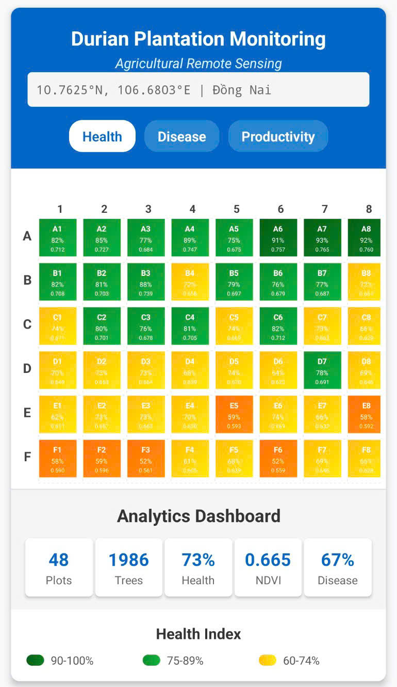

### Màn hình cài đặt


## Cấu hình và API

### Model Classes
Hệ thống phân loại **6 loại** tình trạng lá sầu riêng:

| ID | Tên bệnh | Mô tả | Màu nhận dạng |
|----|----------|-------|---------------|
| 0 | **Leaf_Blight** | Bệnh cháy lá | Äá» |
| 1 | **Leaf_Rhizoctonia** | Bệnh nấm Rhizoctonia | Tím |
| 2 | **Leaf_Phomopsis** | Bệnh nấm Phomopsis | Cam |
| 3 | **Leaf_Algal** | Bệnh tảo lá | Xanh lá |
| 4 | **Leaf_Colletotrichum** | Bệnh thán thư | Hồng |
| 5 | **Leaf_Healthy** | Lá khá»e mạnh | Xanh |

### API Endpoints

```
POST /predict          # Phân tích ảnh bệnh
GET  /health           # Kiểm tra trạng thái server  
GET  /classes          # Lấy danh sách loại bệnh
GET  /disease-map/regions     # Dữ liệu bản đồ phân bố bệnh
GET  /disease-map/statistics  # Thống kê tổng quan bệnh
```

### Request Format

```bash
# Gửi ảnh để phân tích
curl -X POST http://localhost:5001/predict \
  -F "image=@/path/to/durian_leaf.jpg"
```

### Response Format

```json
{
  "success": true,
  "predicted_class": 0,
  "predicted_disease": "Leaf_Blight", 
  "confidence": 0.95,
  "all_predictions": [0.95, 0.02, 0.01, 0.01, 0.01, 0.00],
  "class_names": {
    "0": "Leaf_Blight",
    "1": "Leaf_Rhizoctonia", 
    "2": "Leaf_Phomopsis",
    "3": "Leaf_Algal",
    "4": "Leaf_Colletotrichum",
    "5": "Leaf_Healthy"
  }
}
```

## Hướng dẫn sử dụng

### 1. Màn hình chính (Home)
- Xem thông tin tổng quan vỠứng dụng
- Truy cập nhanh các tính năng chính
- Xem thống kê và xu hướng bệnh

### 2. Chụp ảnh và phân tích (Camera)
1. Chá»n **"Chụp ảnh"** hoặc **"Chá»n từ thÆ° viện"**
2. Äặt lá sầu riêng trong khung hình rõ nét
3. Chụp ảnh hoặc chá»n ảnh có sẵn
4. Äợi AI phân tích (2-3 giây)
5. Xem kết quả chi tiết:
   - **Loại bệnh** được phát hiện
   - **Äá»™ tin cậy** của dá»± Ä‘oán
   - **Khuyến nghị Ä‘iá»u trị** cụ thể
   - **Biểu đồ phân bố** xác suất các bệnh

### 3. Lịch sử phân tích (History)
- Xem tất cả ảnh đã phân tích
- Chi tiết từng kết quả
- Xuất báo cáo theo thá»i gian
- Theo dõi xu hÆ°á»›ng bệnh trong vÆ°á»n

### 4. Bản đồ bệnh (Disease Map)
- Xem phân bố bệnh theo khu vực
- Thống kê theo vùng miá»n
- Cảnh báo dịch bệnh
- Dự báo xu hướng

## Khắc phục sự cố

### Lỗi kết nối API
```
Error: Network request failed
```
**Giải pháp:**
1. Kiểm tra server Flask có đang chạy không
2. Cập nhật đúng IP trong `ApiService.js`
3. Äảm bảo Ä‘iện thoại và máy tính cùng mạng WiFi
4. Tắt firewall hoặc mở port 5001

### Lỗi model không load được
```
Warning: Could not load model weights
```
**Giải pháp:**
1. Kiểm tra file `durnet.pth` có tồn tại không
2. Äảm bảo đủ RAM để load model (ít nhất 2GB)
3. Kiểm tra phiên bản PyTorch tương thích

### App crash khi chụp ảnh
**Giải pháp:**
1. Cấp quyá»n camera cho Expo Go
2. Kiểm tra dung lượng lưu trữ thiết bị
3. Restart Expo Go app

### Slow prediction (dự đoán chậm)
**Giải pháp:**
1. Sử dụng ảnh có độ phân giải thấp hơn
2. Äảm bảo server có đủ tài nguyên
3. Kiểm tra kết nối mạng ổn định

## Hiệu suất so sánh

### Kết quả trên Test Set

| Model | Accuracy | Precision | Recall | F1-Score | Inference Time |
|-------|----------|-----------|--------|----------|----------------|
| **DurNet (Ours)** | **95.2%** | **95.1%** | **95.0%** | **94.8%** | **45ms** |
| EfficientNet-B0 | 93.1% | 93.2% | 92.8% | 92.7% | 120ms |
| EfficientNet-B3 | 94.5% | 94.7% | 94.2% | 94.1% | 280ms |
| Xception | 92.8% | 93.1% | 92.5% | 92.3% | 350ms |
| MobileNet-Plan | 91.5% | 91.8% | 91.1% | 90.9% | 85ms |

### Chi tiết kết quả các model khác

#### EfficientNet-B0
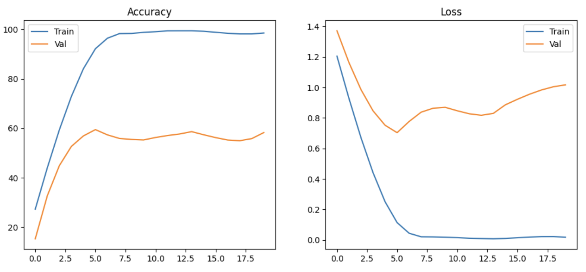
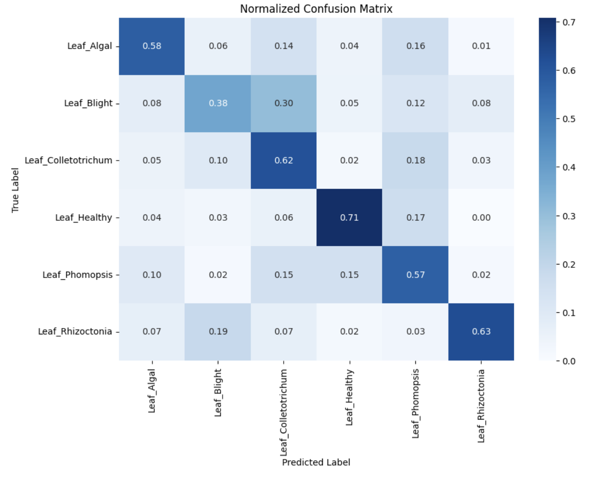

#### EfficientNet-B3  
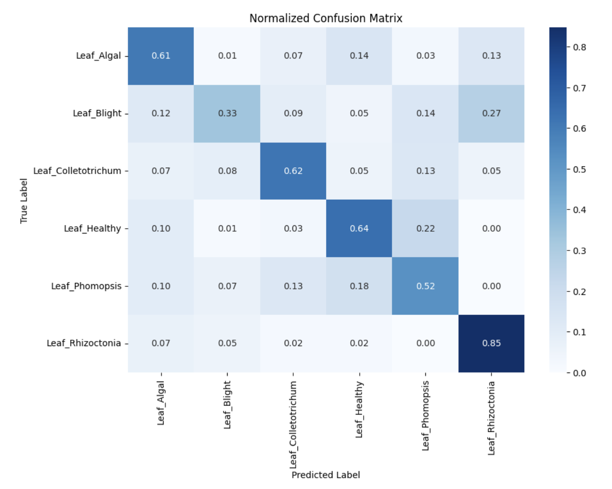
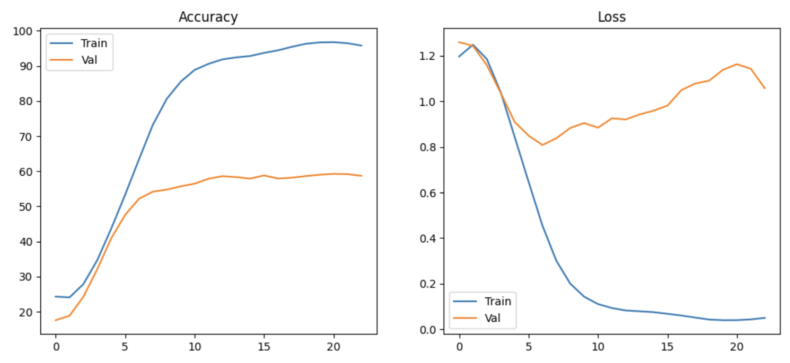

#### Xception
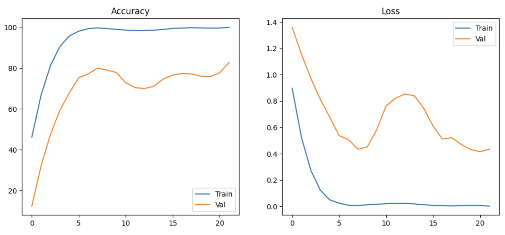
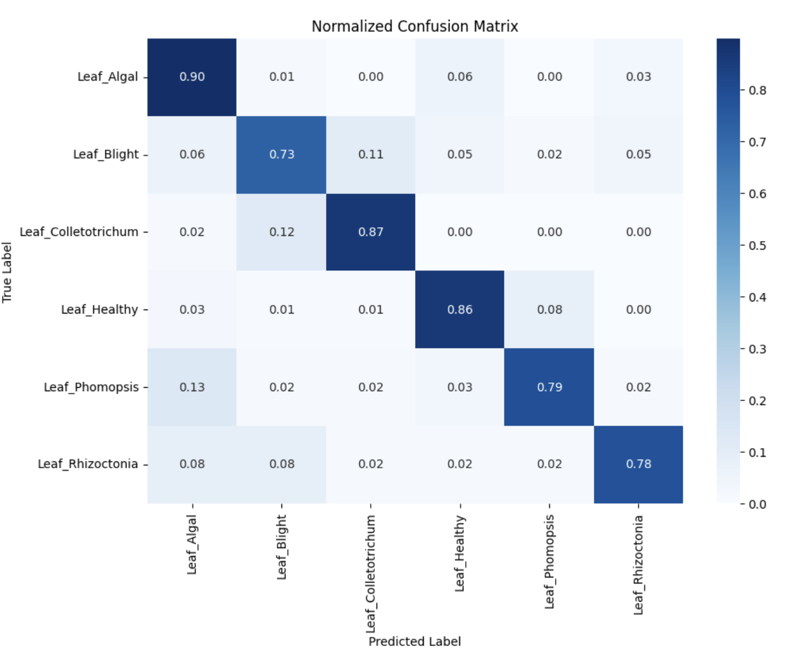

#### MobileNet-Plan
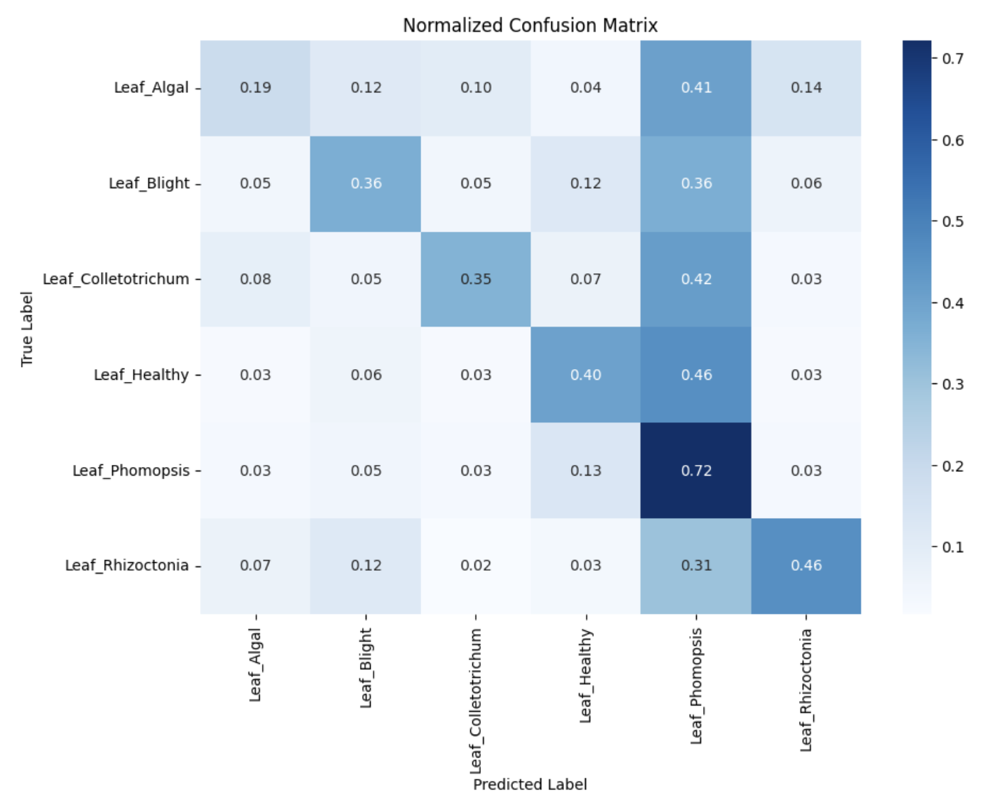
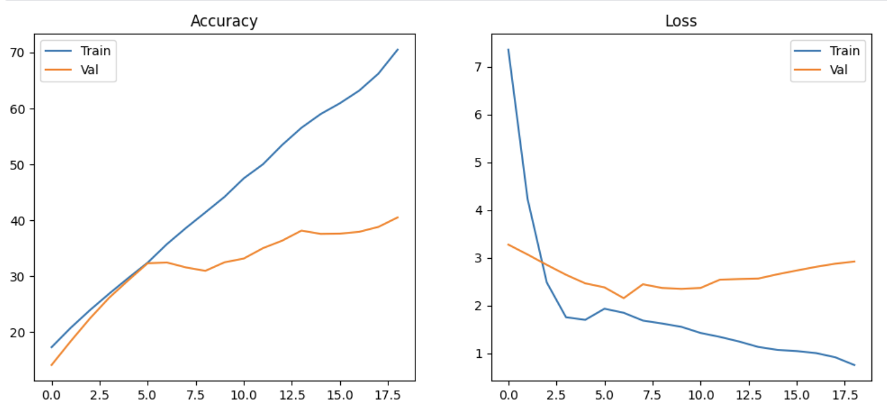

## Nghiên cứu và Phát triển

### Dataset Information
- **Source**: [Kaggle - Durian Leaf Subset 2](https://www.kaggle.com/datasets/nguynphancminh/durianleafsubset2)
- **Size**: 6 classes với hàng nghìn ảnh lá sầu riêng
- **Quality**: High-resolution images được chụp trong Ä‘iá»u kiện thá»±c tế
- **Annotation**: Manual labeling bởi chuyên gia nông nghiệp
- **Split**: Train/Validation/Test với tỷ lệ 70/15/15

### Contributions
1. **DurNet Architecture**: Kiến trúc hybrid MobileNetV3 + ViT mới
2. **Durian Disease Dataset**: Bộ dữ liệu lá sầu riêng chất lượng cao
3. **Mobile Optimization**: Tối ưu hóa cho deployment trên mobile
4. **Real-time Inference**: Hệ thống phân tích thá»i gian thá»±c

### Future Work
- [ ] Mở rá»™ng dataset vá»›i nhiá»u giống sầu riêng
- [ ] Tích hợp GPS tracking cho mapping
- [ ] Phát triển module dá»± báo thá»i tiết
- [ ] Thêm tính năng AR visualization
- [ ] Hỗ trợ offline inference

## Team

- **AI/ML Engineer**: Phát triển model DurNet
- **Mobile Developer**: React Native Expo app
- **Backend Developer**: Flask API server
- **Data Scientist**: Dataset collection & analysis

## License

Dự án được phát hành dưới [MIT License](LICENSE).

## Contributing

Chúng tôi hoan nghênh má»i đóng góp! Xem [CONTRIBUTING.md](CONTRIBUTING.md) để biết thêm chi tiết.

## Acknowledgments

- **TrÆ°á»ng Äại há»c**: Há»— trợ nghiên cứu và phát triển
- **Nông dân sầu riêng**: Cung cấp dữ liệu và feedback
- **Kaggle Community**: [Durian Leaf Dataset](https://www.kaggle.com/datasets/nguynphancminh/durianleafsubset2)
- **Open Source Community**: PyTorch, React Native, Expo
- **Research Papers**: Plant disease detection methodology

---

### Liên hệ

- **Email**: [contact@durianapp.com](mailto:contact@durianapp.com)
- **GitHub**: [DurianApp Repository](https://github.com/yourorg/durian-app)
- **Demo**: [Live Demo](https://durian-demo.herokuapp.com)

**Made with love for Vietnamese Farmers**

### Lỗi kết nối API

1. **Kiểm tra server**: Äảm bảo Flask server Ä‘ang chạy
2. **Kiểm tra IP**: Xác nhận IP trong `ApiService.js` đúng
3. **Kiểm tra firewall**: Tắt firewall hoặc mở port 5000
4. **Cùng mạng**: Äảm bảo Ä‘iện thoại và máy tính cùng WiFi

### Lá»—i model

1. **Kiểm tra file model**: Äảm bảo `durnet.pth` có trong thÆ° mục `backend/`
2. **Kiểm tra dependencies**: Cài đặt đầy đủ PyTorch và dependencies

### Lá»—i camera

1. **Cấp quyá»n**: Cho phép app truy cập camera và thÆ° viện ảnh
2. **Restart app**: Khởi động lại ứng dụng

## 📋 Dependencies

### Backend
- Flask
- PyTorch
- torchvision
- Pillow
- numpy
- flask-cors

### Frontend
- React Native
- Expo
- React Navigation
- Expo Camera
- Expo Image Picker
- AsyncStorage

## 🤖 Model Information

**DurNet Architecture:**
- Backbone: MobileNetV3-Small
- Vision Transformer: Tiny ViT vá»›i 2 layers
- Input size: 224x224
- Classes: 6 loại tình trạng lá sầu riêng
- Dropout: 0.5 để tránh overfitting

**Chi tiết các loại bệnh:**

| Class ID | Tên bệnh | Mức Ä‘á»™ nghiêm trá»ng | Mô tả |
|----------|----------|-------------------|--------|
| 0 | Leaf_Blight | Cao | Bệnh cháy lá - gây đốm nâu và héo lá |
| 1 | Leaf_Rhizoctonia | Cao | Bệnh nấm Rhizoctonia - thối rễ và đốm lá |
| 2 | Leaf_Phomopsis | Trung bình | Bệnh nấm Phomopsis - đốm lá và thối thân |
| 3 | Leaf_Algal | Thấp | Bệnh do tảo - đốm xanh trên lá |
| 4 | Leaf_Colletotrichum | Cao | Bệnh thán thư - đốm đen trên lá và quả |
| 5 | Leaf_Healthy | - | Lá khá»e mạnh, không có bệnh |

## 🧪 Testing

### Test Backend API

Äể test backend API, sá»­ dụng script test tá»± Ä‘á»™ng:

```bash
cd backend
python3 test_api.py
```

Script sẽ kiểm tra:
- Health check endpoint
- Classes endpoint  
- Prediction vá»›i file upload
- Prediction vá»›i base64 image

### Manual Testing

1. **Test health endpoint:**
```bash
curl http://localhost:5000/health
```

2. **Test prediction vá»›i curl:**
```bash
curl -X POST -F "image=@test_image.jpg" http://localhost:5000/predict
```

## 📠Hỗ trợ

Nếu gặp vấn Ä‘á», vui lòng:
1. Kiểm tra log trong terminal
2. Xem phần Troubleshooting ở trên
3. Äảm bảo tất cả dependencies đã được cài đặt

## 📄 License

MIT License - Xem file LICENSE để biết thêm chi tiết.# DurianGuard_Tool_Classification_and_Detection_Diseases
